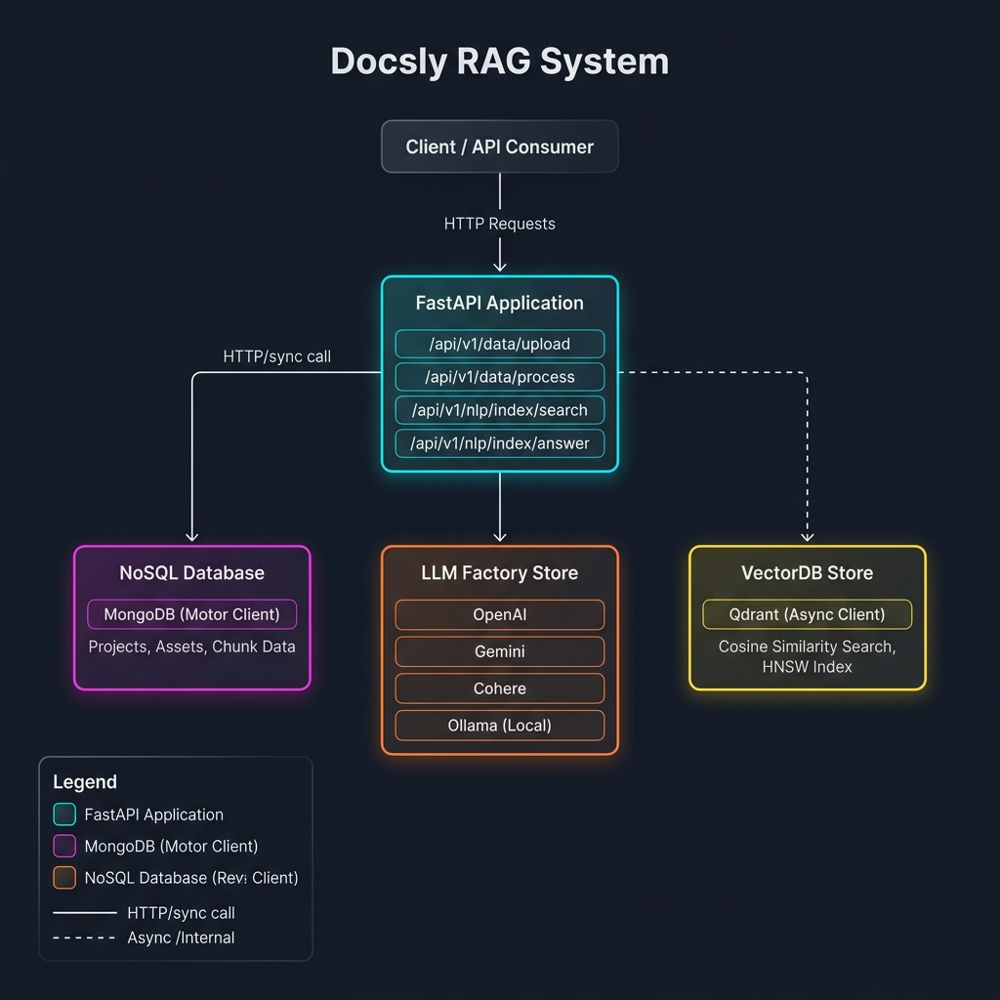

# Docsly - Simple AI Document Reader (RAG)

**Docsly** is an open-source project. It is a **RAG (Retrieval-Augmented Generation)** application. 
This means it helps you upload large documents (like PDFs), reads them, and lets you ask questions about them using AI (like ChatGPT or local models).

## System Architecture



---

## What Does It Do? (Roadmap)
1. **File Upload**: Upload your files and save them in projects.
2. **Chunking**: Cut large documents into smaller pieces so the AI can understand them.
3. **Embeddings (Coming Soon)**: Change the text pieces into numbers (Vectors) so we can search through them quickly.
4. **AI Answers (New! LLM Factory)**: Connect to different AI models (like OpenAI or Ollama) to answer your questions using the document pieces.

---

## Recent Architectural Improvements

We've evolved the project to a production-grade architecture using the **Factory Pattern** and modern FastAPI practices:

### 1. Advanced LLM Factory
- **Supported Providers**: Fully integrated with **OpenAI**, **Cohere**, **Google Gemini**, and **Ollama** (Local).
- **Dynamic Model Selection**: The factory now automatically injects `GENERATION_MODEL_ID` and `EMBEDDING_MODEL_ID` from your `.env` settings into the created providers.
- **Unified Interface**: A strict `BaseLLM` blueprint ensures every AI model works consistently, returning a standardized `LLMResponse`.

### 2. Vector DB Factory (In Progress)
- **Modular Foundation**: We've added the `src/stores/vectordb/` package with a `BaseVectorDB` interface and a `VectorDBProviderFactory`.
- **Qdrant Ready**: Initial support for **Qdrant** is being implemented, allowing for easy switching between different vector databases in the future.

### 3. Modern Lifecycle & Configuration
- **Lifespan Context Manager**: Uses the latest FastAPI `lifespan` pattern for efficient startup (initializing DB connections and LLM clients) and graceful shutdown.
- **Full Config Sync**: The `src/helpers/config.py` is now 100% synchronized with `.env`, supporting all metadata, database, and AI settings.
- **Observability**: Added project-wide `logging` with a configurable `LOG_LEVEL` (INFO, DEBUG, ERROR) controlled directly from the `.env` file.

---

## How to Run the Project Locally

### 1. Install Requirements
First, create a virtual environment and install the required tools:
```bash
# Create virtual environment (for Windows)
py -3.12 -m venv .venv
.venv\Scripts\activate

# Install dependencies
pip install -r src/requirements.txt
```

### 2. Start the Server
Run this command to start the FastAPI server:
```bash
$env:PYTHONPATH="src"; uvicorn main:app --reload --host 0.0.0.0 --app-dir src
```

### 3. Environment Files
You need to copy the example files and add your own secret keys:
- **App Settings**: Copy `src/.env.example` to `src/.env`
- **Docker Settings**: Copy `docker/.env.example` to `docker/.env`

---

## Database (Docker)
We use MongoDB to save your data. You can run it easily using Docker:
```bash
cd docker
docker-compose up -d
```

---

## API Endpoints (How to talk to the app)

| Action | URL | What it does |
|--------|----------|-------------|
| GET  | `/` | Shows a Welcome message |
| GET  | `/api/v1/health` | Checks if the system is working |
| POST | `/api/v1/data/upload/{project_id}` | Uploads a file to a project |
| POST | `/api/v1/data/process/{project_id}` | Cuts the uploaded files into small pieces |

---

*This project is built following the **mini-RAG** series to learn how to build real, professional AI backend systems.*
