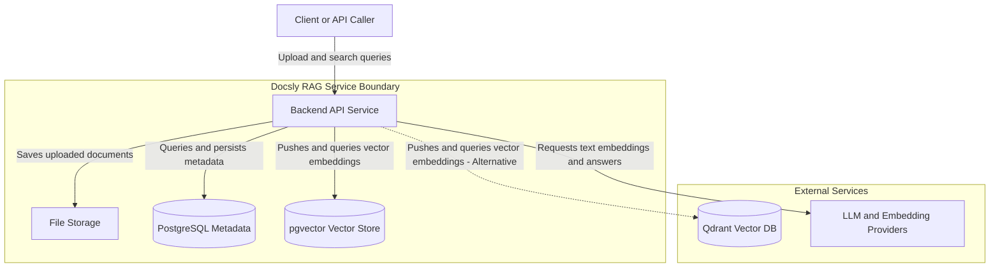

# Docsly

Docsly is a Retrieval-Augmented Generation (RAG) backend service built with FastAPI and PostgreSQL. It lets you upload documents, process them into searchable chunks, index them in a vector database, and query them using large language models.

---

## Table of Contents

- [Overview](#overview)
- [Architecture](#architecture)
- [Tech Stack](#tech-stack)
- [Project Structure](#project-structure)
- [Getting Started](#getting-started)
- [Configuration](#configuration)
- [Database Setup](#database-setup)
- [API Reference](#api-reference)
- [Development Notes](#development-notes)

---

## Overview

Docsly accepts documents (PDF, DOCX, TXT), splits them into chunks, generates vector embeddings, and stores them in a vector database. When a user submits a query, the system retrieves the most relevant chunks and passes them to a language model to generate a grounded answer.

The backend is built as a modular, factory-based system. Each major component (LLM provider, vector database, embedding model) is swappable through environment variables with no code changes.

---

## Architecture

The system architecture and components interaction:



**Request flow:**

1. Client uploads a file to a project via the Data API.
2. The Process endpoint splits the file into text chunks and stores them in PostgreSQL.
3. The NLP Index endpoint embeds the chunks and pushes them into the vector database.
4. The NLP Search endpoint retrieves the top-k relevant chunks and sends them to the LLM for answer generation.

---

## Tech Stack

| Layer            | Technology                            |
|------------------|---------------------------------------|
| Web Framework    | FastAPI 0.115                         |
| ASGI Server      | Uvicorn                               |
| Database ORM     | SQLAlchemy 2.0 (async)                |
| Database Driver  | asyncpg                               |
| Relational DB    | PostgreSQL + pgvector extension       |
| Migrations       | Alembic 1.13                          |
| Vector Database  | pgvector / Qdrant                     |
| LLM Providers    | OpenAI, Cohere, Google Gemini, Ollama |
| Document Parsing | LangChain, PyPDF, PyMuPDF             |
| Configuration    | Pydantic Settings                     |

---

## Project Structure

```
Docsly/
└── src/
    ├── main.py                   # App entry point, lifespan, route registration
    ├── requirements.txt
    ├── .env                      # Local environment variables (not committed)
    ├── .env.example              # Template for environment variables
    ├── wipe_db.py                # Utility to drop and recreate all tables
    │
    ├── helpers/
    │   └── config.py             # Pydantic settings class
    │
    ├── models/
    │   ├── db_schemas/
    │   │   └── docsly/
    │   │       ├── __init__.py
    │   │       └── schema/
    │   │           ├── docsly_base.py    # SQLAlchemy declarative base
    │   │           ├── project.py        # PGProject table
    │   │           ├── asset.py          # PGAsset table
    │   │           └── chunk.py          # PGChunk table
    │   ├── project_repository.py
    │   ├── asset_repository.py
    │   └── chunk_repository.py
    │
    ├── routes/
    │   ├── base.py               # Health check
    │   ├── data.py               # Upload and process endpoints
    │   └── nlp.py                # Index and search endpoints
    │
    ├── controllers/              # Business logic layer
    ├── stores/
    │   ├── llm/                  # LLM factory and providers
    │   └── vectordb/             # Vector DB factory and providers
    └── tasks/                    # Background task workers
```

---

## Getting Started

### Prerequisites

- Python 3.12
- PostgreSQL 15+ with the `pgvector` extension installed
- A running Qdrant instance (optional, only if using Qdrant as the vector backend)

### Installation

```bash
# Clone the repository
git clone https://github.com/your-org/docsly.git
cd docsly

# Create and activate a virtual environment
py -3.12 -m venv .venv
.venv\Scripts\activate         # Windows
# source .venv/bin/activate    # Linux / macOS

# Install dependencies
pip install -r src/requirements.txt
```

### Run the Server

```bash
$env:PYTHONPATH="."; uvicorn main:app --reload --host 0.0.0.0 --app-dir src
```

The API is available at `http://localhost:8000`.  
Interactive documentation is available at `http://localhost:8000/docs`.

---

## Configuration

Copy the example file and fill in your values:

```bash
cp src/.env.example src/.env
```

Key variables in `src/.env`:

```env
# Application
APP_NAME=Docsly
LOG_LEVEL=INFO

# LLM
GENERATION_BACKEND=OPENAI        # OPENAI | COHERE | GEMINI | OLLAMA
EMBEDDING_BACKEND=COHERE
OPENAI_API_KEY=your_key_here
COHERE_API_KEY=your_key_here

# Vector Database
VECTOR_DB_BACKEND=PGVECTOR       # PGVECTOR | QDRANT

# PostgreSQL
POSTGRES_USERNAME=docsly_user
POSTGRES_PASSWORD=your_password
POSTGRES_HOST=localhost
POSTGRES_PORT=5432
POSTGRES_MAIN_DATABASE=docsly
```

---

## Database Setup

### Create the PostgreSQL database

```sql
CREATE USER docsly_user WITH PASSWORD 'your_password';
CREATE DATABASE docsly OWNER docsly_user;
```

### Enable pgvector

Connect to the `docsly` database and run:

```sql
CREATE EXTENSION IF NOT EXISTS vector;
```

The application creates all tables automatically on startup using `Base.metadata.create_all`.

To reset the database (drop and recreate all tables):

```bash
$env:PYTHONPATH="."; python src/wipe_db.py
```

### Database Schema

| Table      | Description                                        |
|------------|----------------------------------------------------|
| `projects` | Top-level container grouping documents and chunks  |
| `assets`   | Individual uploaded files linked to a project      |
| `chunks`   | Text segments extracted from assets, ready for RAG |

Foreign key relationships:

- `assets.asset_project_id` references `projects.id` (CASCADE DELETE)
- `chunks.chunk_project_id` references `projects.id` (CASCADE DELETE)
- `chunks.chunk_asset_id` references `assets.id` (SET NULL on DELETE)

---

## API Reference

### Base

| Method | Endpoint         | Description          |
|--------|------------------|----------------------|
| GET    | `/`              | Welcome message      |
| GET    | `/api/v1/health` | Service health check |

### Data

| Method | Endpoint                            | Description                           |
|--------|-------------------------------------|---------------------------------------|
| GET    | `/api/v1/data/info`                 | Data service info                     |
| POST   | `/api/v1/data/upload/{project_id}`  | Upload a file to a project            |
| POST   | `/api/v1/data/process/{project_id}` | Split uploaded files into text chunks |

### NLP

| Method | Endpoint                                | Description                               |
|--------|-----------------------------------------|-------------------------------------------|
| POST   | `/api/v1/nlp/index/push/{project_id}`   | Embed and index chunks into the vector DB |
| POST   | `/api/v1/nlp/index/search/{project_id}` | Search for relevant chunks using a query  |

---

## Development Notes

### Swapping LLM Providers

Set `GENERATION_BACKEND` or `EMBEDDING_BACKEND` in `.env` to any supported value:

```
OPENAI | COHERE | GEMINI | OLLAMA
```

The factory at `src/stores/llm/LLMProviderFactory` handles instantiation. No code changes are required.

### Swapping Vector Databases

Set `VECTOR_DB_BACKEND` to:

```
PGVECTOR | QDRANT
```

The factory at `src/stores/vectordb/VectorDBProviderFactory` handles instantiation.

### Logging

Log level is controlled by `LOG_LEVEL` in `.env`. Valid values: `DEBUG`, `INFO`, `WARNING`, `ERROR`.

All log entries follow this format:

```
YYYY-MM-DD HH:MM:SS - module_name - LEVEL - message
```
