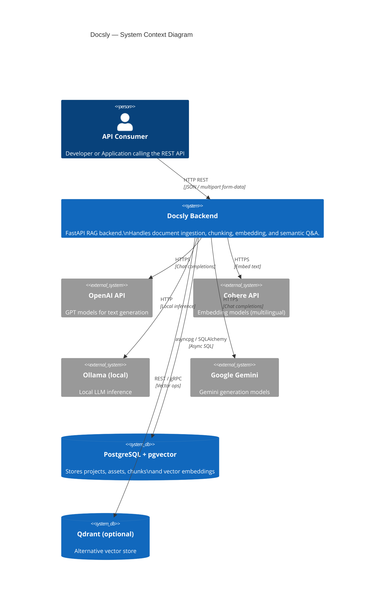
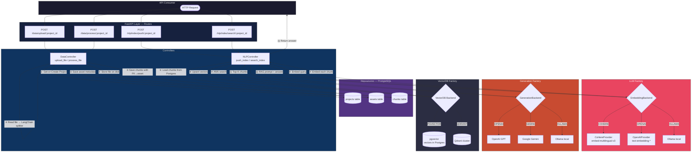

# Docsly — AI Document Q&A Backend (RAG)

**Docsly** is an open-source **RAG (Retrieval-Augmented Generation)** backend. It lets you upload large documents (like PDFs), break them into chunks, turn those chunks into searchable vectors, and ask questions about them using AI models like OpenAI, Cohere, Gemini, or local models via Ollama.

Built on a production-style architecture — Factory Pattern, FastAPI lifespan, pgvector, and modular providers.

---

## Table of Contents

- [What It Does](#what-it-does)
- [Feature Highlights](#feature-highlights)
- [Architecture Overview](#architecture-overview)
- [Tech Stack](#tech-stack)
- [Quick Start](#quick-start)
- [Environment Variables](#environment-variables)
- [Running the Database (Docker)](#running-the-database-docker)
- [API Endpoints](#api-endpoints)
- [Roadmap](#roadmap)
- [Project Structure](#project-structure)
- [Contributing](#contributing)
- [License](#license)
- [Acknowledgements](#acknowledgements)

---

## What It Does

1. **Upload** — Upload files and organize them into projects.
2. **Chunk** — Split large documents into smaller pieces so the AI can process them.
3. **Embed & Index** — Convert chunks into vectors and store them in a vector database (pgvector) for fast semantic search.
4. **Ask** — Query your documents in natural language; the AI answers using the relevant chunks (LLM Factory: OpenAI, Cohere, Gemini, Ollama).

---

## Feature Highlights

### Document Ingestion Pipeline
| Step | Endpoint | Description |
|---|---|---|
| Upload | `POST /data/upload/:project_id` | Accepts PDF, TXT, DOCX up to 10 MB. Saves file to disk and creates asset record in Postgres. |
| Chunk | `POST /data/process/:project_id` | Splits document using LangChain text splitters. Saves each chunk with a foreign key back to its asset. |
| Index | `POST /nlp/index/push/:project_id` | Embeds every chunk via the configured embedding provider and upserts vectors into the vector store. |
| Search | `POST /nlp/index/search/:project_id` | Embeds the user query, runs ANN search, retrieves Top-K chunks, and generates a grounded answer. |

### Multi-Provider AI — Plug & Play

```
Generation Backends     Embedding Backends
─────────────────       ──────────────────
 OpenAI   (GPT-4o)       Cohere   (multilingual-v3)
 Google   (Gemini)       OpenAI   (text-embedding-3)
 Ollama   (local)        Ollama   (local)
```

Swap providers by changing a single env variable — no code changes required.

### Architecture & Engineering

- **Factory Pattern** — LLM and Vector DB providers are fully decoupled from business logic. Add a new provider by implementing one interface.
- **Async-first** — Built on FastAPI + SQLAlchemy (asyncpg) with zero blocking calls in the request path.
- **FastAPI Lifespan** — Clean startup and teardown of database engines, connection pools, and AI clients.
- **Separate chunk/embed steps** — Chunk IDs are persisted in Postgres before embedding, guaranteeing referential integrity in the vector store.
- **pgvector native** — Vectors are stored directly in PostgreSQL alongside relational data — no extra infrastructure needed for the default setup.
- **Modular repositories** — `ProjectRepository`, `AssetRepository`, `ChunkRepository` isolate all DB access behind clean async interfaces.

### Supported File Types

| Format | MIME Type |
|---|---|
| PDF | `application/pdf` |
| Plain Text | `text/plain` |
| Word Document | `application/vnd.openxmlformats-officedocument.wordprocessingml.document` |

---

## Architecture Overview

### System Context



---

### RAG Pipeline — Detailed Flow



Key design choices:
- **Factory Pattern** for LLM providers and Vector DB — swap OpenAI ↔ Ollama or pgvector ↔ Qdrant without touching business logic.
- **FastAPI `lifespan`** for clean startup/shutdown of DB and AI clients.
- Chunking and embedding are **separate steps** so chunk IDs always exist in Postgres before indexing into the vector store (avoids broken foreign keys).
- **Async-first** — SQLAlchemy + asyncpg, no blocking calls in the request path.

---

## Tech Stack

| Layer | Technology |
|---|---|
| API Framework | FastAPI |
| Database | PostgreSQL (+ pgvector) |
| Async Tasks | Celery |
| LLM Providers | OpenAI, Cohere, Google Gemini, Ollama (local) |
| Vector DB | pgvector (Qdrant support planned) |
| Containerization | Docker / docker-compose |

---

## Quick Start

### 1. Clone the repo

```bash
git clone https://github.com/mariiammaysara/Docsly.git
cd Docsly
```

### 2. Create a virtual environment

**Windows (PowerShell):**
```powershell
py -3.12 -m venv .venv
.venv\Scripts\activate
```

**macOS / Linux:**
```bash
python3.12 -m venv .venv
source .venv/bin/activate
```

### 3. Install dependencies

```bash
pip install -r src/requirements.txt
```

### 4. Set up environment files

Copy the example env files and fill in your own keys (OpenAI API key, DB credentials, etc.):

```bash
cp src/.env.example src/.env
cp docker/.env.example docker/.env
```

### 5. Start the database (Docker required)

```bash
cd docker
docker-compose up -d
cd ..
```

### 6. Run the server

**Windows (PowerShell):**
```powershell
$env:PYTHONPATH="src"; uvicorn main:app --reload --host 0.0.0.0 --app-dir src
```

**macOS / Linux:**
```bash
PYTHONPATH=src uvicorn main:app --reload --host 0.0.0.0 --app-dir src
```

### 7. Open it in your browser

- App: `http://localhost:8000`
- Interactive API docs (Swagger): `http://localhost:8000/docs`
- Health check: `http://localhost:8000/api/v1/health`

---

## Environment Variables

Docsly uses two `.env` files:

| File | Purpose |
|---|---|
| `src/.env` | App-level settings: API keys (OpenAI/Cohere/Gemini), `GENERATION_MODEL_ID`, `EMBEDDING_MODEL_ID`, `LOG_LEVEL`, DB connection string |
| `docker/.env` | Docker/Postgres credentials used by `docker-compose.yml` |

Never commit real `.env` files — only `.env.example` should be tracked in git. Double-check `.gitignore` covers both.

---

## Running the Database (Docker)

```bash
cd docker
docker-compose up -d
```

This spins up PostgreSQL (with pgvector extension) for storing projects, files, chunks, and vector embeddings.

---

## API Endpoints

| Method | URL | Description |
|---|---|---|
| GET | `/` | Welcome message |
| GET | `/api/v1/health` | Health check |
| POST | `/api/v1/data/upload/{project_id}` | Upload a file to a project |
| POST | `/api/v1/data/process/{project_id}` | Chunk the uploaded file and save chunks to Postgres |
| POST | `/api/v1/nlp/index/push/{project_id}` | Embed chunks and index them into the vector DB |

Full interactive docs available at `/docs` once the server is running.

---

## Postman Collection

A ready-to-use [Postman](https://www.postman.com/) collection is included so you can test every endpoint without writing requests manually.

1. Open Postman → **Import** → select `postman/Docsly.postman_collection.json`
2. Set the collection variable `base_url` to your running server (default: `http://localhost:8000/api/v1`)
3. Run **Upload** → **Process** → **Index** in order to test the full pipeline on a sample file

> 📌 If you don't see the collection file yet, it's coming soon — export it from your local Postman workspace and add it to `postman/Docsly.postman_collection.json` in the repo.

---

## Planned Improvements

- [ ] OCR support for scanned PDFs and images
- [ ] Improved RAG retrieval (reranking, hybrid search)
- [ ] Multi-document cross-referencing in answers
- [ ] Streaming responses for LLM output
- [ ] Celery-based async processing for large files
- [ ] Qdrant vector store provider
- [ ] Conversation history & multi-turn Q&A

---

## Project Structure

```
Docsly/
├── docker/              # docker-compose + Docker env config
├── src/
│   ├── controllers/      # ProcessController, NLPController, etc.
│   ├── routes/           # FastAPI route definitions
│   ├── models/           # DB models (Postgres)
│   ├── stores/
│   │   ├── llm/           # LLM Factory (OpenAI, Cohere, Gemini, Ollama)
│   │   └── vectordb/      # Vector DB Factory (pgvector, Qdrant)
│   ├── helpers/          # Config, logging, utilities
│   └── main.py           # FastAPI app entrypoint
├── .gitignore
├── ACKNOWLEDGEMENT.md
├── LICENSE
├── PROGRESS.md
└── README.md
```

---

## Contributing

Issues, suggestions, and pull requests are welcome. If you'd like to contribute:

1. Fork the repo
2. Create a feature branch (`git checkout -b feature/your-feature`)
3. Commit your changes
4. Open a Pull Request

---

## License

This project is licensed under the [Apache 2.0 License](./LICENSE).

---

## Acknowledgements

Built on the foundation of **Eng. Abu Bakr Soliman**'s work. See [ACKNOWLEDGEMENT.md](./ACKNOWLEDGEMENT.md).

---

<p align="center"><em><a href="https://mariammaysara.com">© Mariam Maysara</a></em></p>
